# 🎮 TINA MINIGAME — Phân Tích & Đánh Giá Toàn Diện

> **Ngày phân tích:** 15/04/2026
> **Phạm vi:** Toàn bộ codebase `tina-minigame`

---

## 1. Tổng Quan Dự Án

| Thuộc tính | Giá trị |
|---|---|
| **Framework** | Next.js 16 (App Router) + React 19 |
| **Ngôn ngữ** | JavaScript (không TypeScript) |
| **Backend** | Supabase (PostgreSQL + Realtime + Auth) |
| **State Management** | Zustand (multiplayer) + React useState (local) |
| **Data Fetching** | TanStack React Query + Server Actions |
| **Media** | Cloudinary (upload/CDN) |
| **Audio** | Web Audio API (SFX) + Howler.js (music) |
| **Styling** | CSS Modules + CSS Custom Properties |
| **Vật lý/Game** | Phaser 4 (Maze Chase) |
| **Target** | Nền tảng giáo dục K-12, hỗ trợ multiplayer 30+ người |

**Mô tả 1 câu:** Nền tảng giáo dục gamified cho phép giáo viên tạo trò chơi tương tác (quiz, matching, word games...) và chia sẻ cho học sinh chơi trực tiếp theo thời gian thực.

---

## 2. Kiến Trúc Hệ Thống

```mermaid
graph TB
    subgraph "Frontend (Next.js 16 App Router)"
        A[Layout + AuthProvider + QueryProvider]
        B["/ — Homepage (SSR)"]
        C["/templates — Browse Games"]
        D["/create/[slug] — Activity Creator"]
        E["/[id] — Play Room (Host + Player)"]
        F["/play — Global Join Page"]
        G["/dashboard — Teacher Dashboard"]
    end

    subgraph "Game Engine Layer"
        H["useSelectionEngine — Quiz/MCQ/T-F"]
        I["usePairingEngine — Matching/GroupSort"]
        J["useOrderingEngine — Unjumble/Anagram"]
        K["useRevealEngine — Cards/Wheel"]
        L["useActionEngine — WhackAMole"]
        M["useGameEvents — Event Bus + Sound"]
    end

    subgraph "Multiplayer Stack"
        N["roomStore (Zustand)"]
        O["useRoomChannel — Broadcast + Presence"]
        P["useRoomActions — Host Controls"]
        Q["useGameplay — Player Flow"]
        R["usePowerUps — Item System"]
    end

    subgraph "Backend (Supabase)"
        S["mg_activities — Activity Records"]
        T["mg_content_items — Questions/Items"]
        U["mg_rooms — Room Sessions"]
        V["mg_room_players — Player Records"]
        W["Realtime Channels — Broadcast + Presence"]
    end

    D --> S
    D --> T
    E --> U
    E --> V
    E --> W
    E --> N
    N --> O
    O --> W
    E --> H & I & J & K & L
```



---

## 3. Phân Tích Theo Module

### 3.1 📋 Template & Game Registry

**Files:** `templates.js`, `gameRegistry.js`

| Điểm | Đánh giá |
|---|---|
| **Thiết kế Single Source of Truth** | ⭐⭐⭐⭐⭐ Xuất sắc |
| **Số lượng template** | 40+ templates, 10 categories |
| **Engine mapping** | 5 engine types, fallback system |

> [!TIP]
> Đây là điểm mạnh nhất của kiến trúc. TEMPLATES array là source of truth duy nhất — gameRegistry.js tự derive từ đó. Thêm template mới chỉ cần 1 object → tự động xuất hiện trên mọi trang.

**Điểm mạnh:**
- `ENGINE_FALLBACKS` pattern rất thông minh — template không có player riêng sẽ tự fallback
- Helper functions (`getActiveCategories`, `searchTemplates`, etc.) được thiết kế clean
- `parseImportText()` hỗ trợ 8+ content formats

**Vấn đề cần cải thiện:**
- ⚠️ **Template trùng lặp:** `maze-chase` (id=27) và `mazechase` (id=999) cùng có `playerType: 'mazechase'` — gây confusion
- ⚠️ Nhiều template PRO dùng `fallbackPlayer` → user thấy tên khác nhau nhưng gameplay giống nhau (VD: Balloon Pop, Pair or No Pair, Speed Sorting đều fallback về `matchingpairs`)
- 💡 Thiếu validation — `supportedFormats: ['DIAGRAM']` tồn tại nhưng không thấy DIAGRAM editor thực sự

---

### 3.2 🎮 Game Engine Layer

**Files:** `useSelectionEngine.js` + 5 engine hooks khác

| Engine | Phục vụ | Chất lượng |
|---|---|---|
| `useSelectionEngine` | Quiz, Gameshow, True/False, TypeAnswer | ⭐⭐⭐⭐ Tốt |
| `usePairingEngine` | MatchingPairs, MatchUp, GroupSort | ⭐⭐⭐⭐ Tốt |
| `useOrderingEngine` | Unjumble, Anagram, SpellTheWord | ⭐⭐⭐⭐ Tốt |
| `useRevealEngine` | FlashCards, SpeakingCards, SpinWheel | ⭐⭐⭐ Khá |
| `useActionEngine` | WhackAMole, MazeChase | ⭐⭐⭐ Khá |
| `useGameEvents` | Event bus + Sound orchestration | ⭐⭐⭐⭐⭐ Xuất sắc |

**Điểm mạnh:**
- ✅ **useRef pattern cho stale closure fix** — `stateRef.current` idiom rất đúng cách
- ✅ **Headless hook design** — engine tách biệt hoàn toàn khỏi UI, dễ reuse
- ✅ TTS opt-in flag (`enableTTS`) — tránh auto-read khi không cần
- ✅ Fisher-Yates shuffle đúng thuật toán

**Vấn đề cần cải thiện:**
- ⚠️ **Scoring formula không nhất quán:** `useSelectionEngine` tự tính điểm inline thay vì dùng `calcScore()` từ `scoringEngine.js` → hai hệ thống điểm tồn tại song song
- ⚠️ Timer uses `setInterval` 1s → độ chính xác ±1s, không phù hợp cho competitive scoring (nên dùng `performance.now()` delta)
- ⚠️ `handleSubmitAnswer` gọi `handleAdvanceToNext` qua setTimeout nhưng không cleanup → potential memory leak nếu unmount giữa chừng

---

### 3.3 🔌 Multiplayer System

**Files:** `roomStore.js`, `useRoomChannel.js`, + 3 hooks khác

| Khía cạnh | Đánh giá |
|---|---|
| **Architecture** | ⭐⭐⭐⭐⭐ Production-ready |
| **Realtime sync** | ⭐⭐⭐⭐ Tốt |
| **Error recovery** | ⭐⭐⭐⭐ Tốt |
| **Ghost cleanup** | ⭐⭐⭐⭐ Tốt |

> [!IMPORTANT]
> Đây là phần phức tạp nhất của codebase và được thiết kế rất tốt.

**Điểm mạnh:**
- ✅ **Zustand store** — Clean separation giữa state container và business logic
- ✅ **Presence + Ghost cleanup** — Host tự dọn player offline sau grace period
- ✅ **DB Reconciliation on reconnect** — Khi client reconnect, tự đồng bộ phase từ DB (critical fix cho mobile)
- ✅ **Beacon close** — Host tự đánh dấu room `finished` khi đóng tab (sử dụng `keepalive: true`)
- ✅ **Host offline detection** — Client tự thoát nếu host mất kết nối > 3s
- ✅ **Power-up system** — 20 items, 5 rarity tiers, shield/boomerang mechanics

**Vấn đề cần cải thiện:**
- ⚠️ **Mutating `_refs` object trực tiếp** — Anti-pattern trong React, nhưng chấp nhận được vì Zustand quản lý
- ⚠️ **`fetchPlayersDebounced` dùng 300ms** — Có thể gây lag cho initial player list
- ⚠️ **Hardcoded 3s timeout** cho host offline — Quá ngắn cho mạng 3G/4G yếu
- 🔴 **Security concern:** `activityActions.js` dùng `supabase` client (anon key) trong Server Action — nên dùng `getServiceSupabase()` để bypass RLS khi cần

---

### 3.4 ✏️ Content Editor (Creator)

**Files:** 21 files trong `ContentEditor/`, `create/[slug]/page.js` (1028 lines)

| Khía cạnh | Đánh giá |
|---|---|
| **Feature completeness** | ⭐⭐⭐⭐⭐ Rất đầy đủ |
| **Code organization** | ⭐⭐⭐ Trung bình |
| **UX** | ⭐⭐⭐⭐ Tốt |

**Điểm mạnh:**
- ✅ 10+ loại editor chuyên biệt (MCQ, TrueFalse, Pairs, Group, Wheel, SpellWord...)
- ✅ Auto-save mỗi 30s
- ✅ Import text tự động (parseImportText) + AI-powered PDF import
- ✅ Drag-to-reorder slides (hold-to-drag pattern)
- ✅ Cloudinary image upload tích hợp
- ✅ TTS preview trong editor

**Vấn đề nghiêm trọng:**
- 🔴 **`create/[slug]/page.js` quá lớn — 1028 lines** trong 1 file client component. Vi phạm Single Responsibility Principle. Cần tách thành:
  - `useCreateActivity` hook (business logic)
  - `CreateHeader` component
  - `SlideCarousel` component
  - `ImportModal` component
- ⚠️ **Auto-save gọi `performSave(true)` mỗi 30s** — luôn DELETE + INSERT lại toàn bộ items → không efficient, gây overhead DB
- ⚠️ `handleDataImport` import `parseImportText` dynamically — nhưng nó đã được import tĩnh ở đầu file
- ⚠️ Slide state dùng `currentIndex = -1` cho Settings page → magic number, nên dùng enum

---

### 3.5 🎨 Design System & CSS

**Files:** `tokens.css`, `globals.css`, `layout.css`, `utilities.css`

| Khía cạnh | Đánh giá |
|---|---|
| **Token system** | ⭐⭐⭐⭐⭐ Professional |
| **Responsive** | ⭐⭐⭐⭐ Tốt (fluid typography) |
| **Accessibility** | ⭐⭐⭐⭐ Tốt |
| **Consistency** | ⭐⭐⭐ Trung bình |

**Điểm mạnh:**
- ✅ **Production-quality design tokens** — fluid type scale (`clamp()`), shadow scale, spacing scale
- ✅ `prefers-reduced-motion` support
- ✅ `:focus-visible` styling, `.sr-only` utilities
- ✅ `dvh` height fix cho iOS Safari
- ✅ Custom Vietnamese handwriting fonts (tapviet)

**Vấn đề cần cải thiện:**
- ⚠️ **Legacy color aliases tồn tại song song** với token mới → dễ confuse
- ⚠️ Một số component dùng inline styles thay vì CSS modules (VD: `play/page.js` error modal)
- ⚠️ Font import qua `@import url()` trong CSS → render-blocking. Nên chuyển sang `next/font`

---

### 3.6 🔊 Sound & Effects System

**Files:** `sounds.js`, `confettiEffects.js`

| Khía cạnh | Đánh giá |
|---|---|
| **SFX variety** | ⭐⭐⭐⭐⭐ 25+ synthesized sounds |
| **Architecture** | ⭐⭐⭐⭐ Singleton pattern |
| **Visual effects** | ⭐⭐⭐⭐⭐ TV-gameshow level |

**Điểm mạnh:**
- ✅ **Zero external audio files cho SFX** — toàn bộ synthesized bằng Web Audio API
- ✅ Volume persistence qua localStorage
- ✅ Lazily imported Howler.js cho background music
- ✅ Confetti effects rất phong phú (correct, wrong, streak, jackpot, game complete)
- ✅ Screen effects (flash green/red, shake, timer danger pulse)

**Vấn đề cần cải thiện:**
- ⚠️ `SoundManager` không cleanup `AudioContext` khi page inactive → potential memory leak
- ⚠️ Singleton pattern cùng với SSR (`typeof window !== 'undefined'` guards) — safe nhưng verbose

---

### 3.7 🔐 Auth & Security

**Files:** `AuthContext.js`, `supabase.js`, `.env.local`

| Khía cạnh | Đánh giá |
|---|---|
| **Auth flow** | ⭐⭐⭐ Cơ bản |
| **Security** | ⭐⭐ Cần cải thiện |

> [!CAUTION]
> Có một số vấn đề bảo mật cần xử lý ngay.

**Vấn đề bảo mật:**
1. 🔴 **`.env.local` chứa các secret keys** — `SUPABASE_SERVICE_ROLE_KEY` và `CLOUDINARY_API_SECRET` đang trong file tracked bởi Git → **rủi ro lộ secret nếu push lên GitHub**
2. 🔴 **`isTeacher: !!user`** — Bất kỳ ai đăng nhập đều là "teacher" → không có role-based access control
3. 🔴 **Server Action dùng client Supabase** — `activityActions.js` sử dụng browser Supabase client thay vì service role client, gây vấn đề khi RLS bật
4. ⚠️ **Không dùng `@supabase/ssr`** mặc dù đã cài — bỏ lỡ server-side cookie-based auth

---

### 3.8 📁 Cấu Trúc Thư Mục & Code Hygiene

| Khía cạnh | Đánh giá |
|---|---|
| **Folder structure** | ⭐⭐⭐⭐ Tốt |
| **Code documentation** | ⭐⭐⭐⭐⭐ Xuất sắc |
| **Dead code** | ⭐⭐ Nhiều |

**Điểm mạnh:**
- ✅ Mỗi game có folder riêng (`src/games/[name]/`)
- ✅ Components tổ chức theo feature folder
- ✅ JSDoc comments rất rõ ràng, có công thức scoring
- ✅ Header comments trong mỗi module giải thích purpose

**Vấn đề — Dead/Test files ở root:**
```
❌ fix_deobfuscation.js / deobfuscate_proper.js
❌ extract_font_script.js / test_*.js
❌ test_pdf.py / test_perf.py / crop_avatars.py
❌ lophoc_source*.html
❌ *.json / *.txt tests
```
→ **17+ file rác/test** ở root. Nên di chuyển vào `scripts/` hoặc xóa.

---

## 4. Bảng Điểm Tổng Hợp

| Tiêu chí | Điểm | Ghi chú |
|---|:---:|---|
| **🏗️ Architecture** | **8.5** | Engine pattern, SSoT template, Zustand multiplayer xuất sắc |
| **🎮 Feature Set** | **9.0** | 40+ games, multiplayer, power-ups, TTS, auto-import cực mạnh |
| **🎨 UI/UX Design** | **8.0** | Design tokens tốt, có responsive, nhưng còn inline styles |
| **🔊 Audio/FX** | **9.0** | Âm thanh zero-deps, hệ thống particle xuất sắc |
| **🔐 Security** | **4.5** | Secrets exposed, RBAC yếu |
| **📱 Mobile Ready** | **7.5** | Touch optimzed, dvh fix, timer logic cần tút lại |
| **🧹 Code Quality** | **6.5** | Create page quá to, nhiều rễ test file |
| **⚡ Performance** | **7.0** | React 19 tối ưu, auto-save cần tune |
| **🔗 Multiplayer** | **8.5** | Reconnect flow tốt, sync chuẩn |
| **📦 Scalability** | **7.0** | Cấu trúc ok nhưng thiếu tools như TS/Tests |
| **TỔNG ĐIỂM** | **7.6** | ⭐⭐⭐⭐ Dự án đang trên bờ vực Production-ready |

---

## 5. Khuyến Nghị Ưu Tiên

### 🔴 Ưu tiên CAO (Fix Ngay Lập Tức)
1. **Dọn `.env.local` khỏi Git**, rotate các secret key trên Supabase/Cloudinary ngay lập tức nếu Repo đang public.
2. Dùng `@supabase/ssr` (server-side auth) hoặc dùng `getServiceRoleClient` cho `activityActions.js` để tránh conflict RLS.
3. Chuyển/xóa ngay 17+ dead test files ở root (`fix_deobfuscation.js`...) vào thư mục `scripts` riêng để dọn dẹp không gian.

### 🟡 Ưu tiên TRUNG BÌNH (Tối ưu)
4. Chia nhỏ con quái vật `create/[slug]/page.js` 1028 dòng thành module.
5. Sửa tính điểm "thủ công" ở `useSelectionEngine` thành hook sang file `scoringEngine`.
6. Fix trùng lặp template (`maze-chase` / `mazechase`).
7. Tối ưu auto-save: Thay vì `DELETE` + `INSERT` liên tục, nên sử dụng `UPSERT` dựa trên ID ảo.

### 🟢 Ưu tiên THẤP (Cho tương lai)
8. Bổ sung TypeScript.
9. Đóng gói audio manager thành Web Worker hoặc Cleanup event hợp lý hơn.
10. Ráp Unit test cho GameRegistry & Multiplayer heartbeat.
